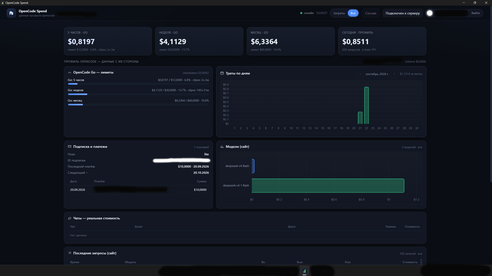

# OpenCode Spend

[](https://dotnet.microsoft.com/)
[](https://learn.microsoft.com/dotnet/desktop/wpf/)
[](https://www.docker.com/)
[](https://www.sqlite.org/)
[](#)
[](#)

Мониторинг расходов и активности opencode. Приложение на ПК собирает данные и
шлёт их на сервер, а на сервере работает веб-панель с аккаунтами: траты, лимиты
Go, платежи, активные чаты с фазами и кнопкой остановки агентов. Всё считается по
данным opencode.ai (консоль) и локальной базы opencode.



*Веб-панель: траты, лимиты Go, разбивка по моделям и активные сессии.*

## ✨ Возможности

- **Лимиты Go** — окна 5 часов / неделя / месяц с прогрессом.
- **Траты по дням** — динамика расходов.
- **Разбивка по моделям** — где именно уходит бюджет.
- **История запросов** — журнал обращений к моделям.
- **Платежи и подписка** — статус оплат и текущего плана.
- **Живые сессии с фазами** — видно, что делает агент прямо сейчас.
- **Остановка агентов** — команда «Стоп» уходит на ПК.
- **Мультиаккаунт** — несколько аккаунтов на одном сервере.
- **Привязка ПК по коду** — один аккаунт = один ПК.
- **Вход Google/GitHub + код доступа** — провайдеры опциональны.
- **Мгновенные обновления через SSE** — браузер обновляется без перезагрузки.

## 🏗 Архитектура

```
┌─────────────── ПК (Windows) ───────────────┐        ┌──────── СЕРВЕР (Linux/Docker) ────────┐
│ opencode  ──SSE──▶ сборщик ──POST /api/device/sync──▶│ аккаунты, SQLite, веб-панель          │
│     ▲                   ◀── команды (стоп) ──────────│ /api/events (SSE) ──▶ браузер         │
└────────────────────────────────────────────┘        └──────────────────────────────────────┘
```

Одна сборка играет две роли. Роль задаётся конфигом `Spend:Mode` (`server` или
`collector`) и наличием локальной базы opencode:

- **СЕРВЕР** (`Spend__Mode=server`) — аккаунты, вход, хранение данных, веб-панель.
  Сам в opencode не ходит.
- **СБОРЩИК** (приложение на ПК, WPF + WebView2) — поднимает панель на случайном
  локальном порту, собирает данные и отправляет их на сервер.

Связь: ПК привязывается к аккаунту кодом подключения (в нём зашифрован адрес
сервера), дальше раз в секунду шлёт один запрос `POST /api/device/sync` и получает
в ответе команды. Если сервер отвечает 401 — ПК отвязывается.

## 🚀 Быстрый старт

Сервер (локально, через Docker):

```bash
docker compose up -d --build
# панель: http://127.0.0.1:15000
```

Приложение для ПК:

```bash
dotnet publish src/OpenCodeSpend.Desktop -c Release -r win-x64 --self-contained true -p:PublishSingleFile=true
```

Первый вход: на сервере войти через Google/GitHub либо по коду доступа к аккаунту;
затем «Управление соединением» → взять код → вставить в приложении в «Подключить
сервер».

## 🐳 Развёртывание на сервере

Нужен Linux-сервер с Docker и плагином `docker compose`.

**Что скопировать.** Папку проекта с `docker-compose.yml`, `Dockerfile` и
исходниками `src/OpenCodeSpend.Web`. Образ собирается двухстадийно:
`mcr.microsoft.com/dotnet/sdk:10.0` выполняет `restore` и
`publish -c Release -o /app`, затем рантайм `mcr.microsoft.com/dotnet/aspnet:10.0`
копирует `/app` и запускает `dotnet OpenCodeSpend.Web.dll`.

**Конфигурация.** Создайте `.env` на основе `.env.example` и задайте значения.

**Запуск.**

```bash
docker compose up -d --build   # собрать и поднять
docker compose logs -f         # логи в реальном времени
docker compose down            # остановить (тома сохраняются)
```

**Порты.** Внутри контейнера приложение слушает `5199`, наружу порт публикуется
только на loopback хоста:

```yaml
ports:
  - "127.0.0.1:15000:5199"
```

Публиковать `5199` напрямую в интернет не нужно — снаружи доступ идёт через
reverse-proxy на `127.0.0.1:15000`.

**Тома.** Данные переживают пересборку благодаря двум томам:

```yaml
volumes:
  - appdata:/data
  - dpkeys:/root/.aspnet/DataProtection-Keys
```

`appdata` хранит SQLite-базу `/data/opencodespend.db`. `dpkeys` хранит ключи
ASP.NET Core Data Protection: при их потере инвалидируются cookie сессий и все
пользователи разлогинятся, а данные аккаунтов останутся.

**Обновление.** `docker compose up -d --build` пересобирает и поднимает заново.
Для автозапуска включите у службы Docker политику `restart: unless-stopped`
(уже задана в compose) — контейнер поднимется после перезагрузки хоста.

## 🔒 Домен и HTTPS

Панель сама HTTPS не терминирует — нужен Caddy или nginx на хосте, который
слушает домен, выдаёт TLS и проксирует на `127.0.0.1:15000`. Приложение читает
заголовки `X-Forwarded-Proto` и `X-Forwarded-Host` и строит ссылки, включая
OAuth-редиректы, из схемы и хоста запроса.

Пример Caddy:

```caddyfile
ocspend.example.com {
    reverse_proxy 127.0.0.1:15000
}
```

Пример nginx (TLS добавьте отдельно, например через certbot):

```nginx
server {
    listen 80;
    server_name ocspend.example.com;

    location / {
        proxy_pass http://127.0.0.1:15000;
        proxy_set_header Host              $host;
        proxy_set_header X-Forwarded-Proto $scheme;
        proxy_set_header X-Forwarded-Host  $host;
        proxy_set_header X-Forwarded-For   $proxy_add_x_forwarded_for;
    }
}
```

Для потока `/api/events` (SSE) в nginx **обязательно** отключить буферизацию,
иначе обновления не будут приходить мгновенно:

```nginx
location /api/events {
    proxy_pass http://127.0.0.1:15000;
    proxy_buffering off;
    proxy_set_header Host              $host;
    proxy_set_header X-Forwarded-Proto $scheme;
    proxy_set_header X-Forwarded-Host  $host;
}
```

**Адреса возврата OAuth.** В консолях провайдеров прописать:

- Google Cloud Console → OAuth 2.0 Client ID → Authorized redirect URIs:
  `https://<домен>/signin-google`
- GitHub → OAuth App → Authorization callback URL: `https://<домен>/signin-github`

Адрес приложение вычисляет из самого запроса, поэтому он должен совпадать с тем,
по которому открыта панель. Если OAuth не нужен — вход по коду доступа к аккаунту
работает всегда.

## ⚙️ Переменные окружения

`docker-compose.yml` читает из `.env` эти переменные. Секреты живут только в
`.env` (в образ не попадают) и передаются контейнеру как `Spend__*`.

| Переменная | Значение | Зачем |
| --- | --- | --- |
| `TZ` | `Europe/Moscow` | часовой пояс сервера |
| `PAIRING_TTL` | `5` | срок жизни кода подключения ПК, минуты |
| `GOOGLE_CLIENT_ID` | `` | OAuth-клиент Google (опционально) |
| `GOOGLE_CLIENT_SECRET` | `` | секрет OAuth-клиента Google |
| `GITHUB_CLIENT_ID` | `` | OAuth-клиент GitHub (опционально) |
| `GITHUB_CLIENT_SECRET` | `` | секрет OAuth-клиента GitHub |

## 🔌 Порты

| Порт | Где | Назначение |
| --- | --- | --- |
| `5199` | внутри контейнера | `ASPNETCORE_URLS` / `EXPOSE`, менять не нужно |
| `15000` | проброс на хосте | `127.0.0.1:15000:5199`, вход для reverse-proxy |
| `80` / `443` | reverse-proxy | Caddy/nginx, публикация в интернет |
| случайный | локально на ПК | панель приложения, только `127.0.0.1` |

## 🧭 Пример работы

1. Развернули сервер и открыли панель по своему домену.
2. Вошли — через Google/GitHub или по коду доступа к аккаунту.
3. На панели открыли «Управление соединением» и взяли код подключения.
4. Вставили код в приложении в «Подключить сервер».
5. На панели появились траты и лимиты Go.
6. В разделе «Сессии» видно активные чаты с фазами (печатает, инструмент, команда).
7. Нажали «Стоп» — агент остановлен, состояние обновилось мгновенно.

## 🧱 Стек

- **.NET 10**
- **ASP.NET Core** — серверная логика, API и веб-панель
- **WPF + WebView2** — приложение для ПК
- **SQLite** — единственное хранилище, один файл
- **Docker** — сборка и развёртывание сервера

## 📁 Структура

```
OpencodeSpend/
├─ src/
│  └─ OpenCodeSpend.Web/       # логика + wwwroot (index.html, app.js, styles.css)
│  └─ OpenCodeSpend.Desktop/   # WPF + WebView2, сбор и отправка данных
├─ tests/
│  └─ OpenCodeSpend.Tests/     # самопроверки
├─ docs/                       # скриншот
├─ docker-compose.yml
├─ Dockerfile
└─ .env.example
```

## 🧪 Тесты

```bash
dotnet run --project tests/OpenCodeSpend.Tests
```

42 самопроверки.

## ❓ Частые проблемы

- **`redirect_uri_mismatch`** — адрес возврата не прописан в консоли провайдера.
- **В панели «нет данных»** — ПК не привязан или отвязан (сервер ответил 401).
- **Профиль не подтягивается** — в приложении истекла сессия opencode, нужно войти
  заново.
- **После пересборки пропали сессии** — проверьте, что том `dpkeys` на месте.

---

Репозиторий приватный. Все права защищены. © 2026 OpenCode Spend.
