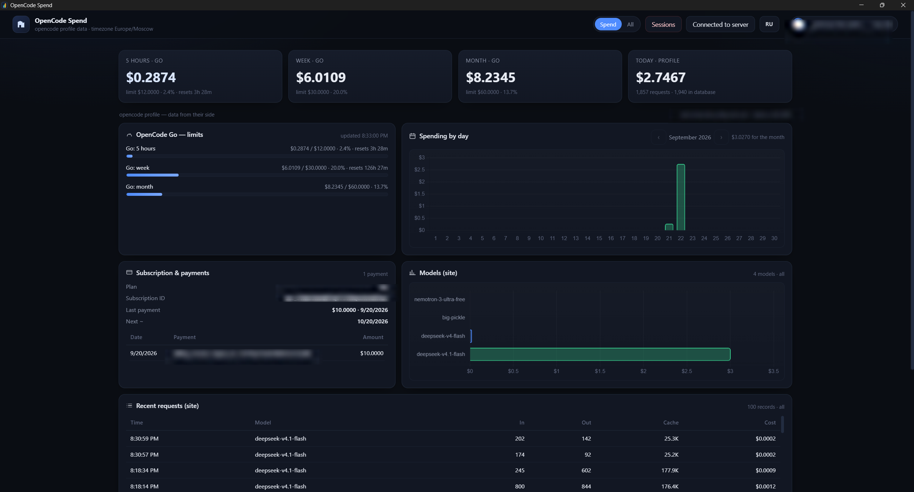
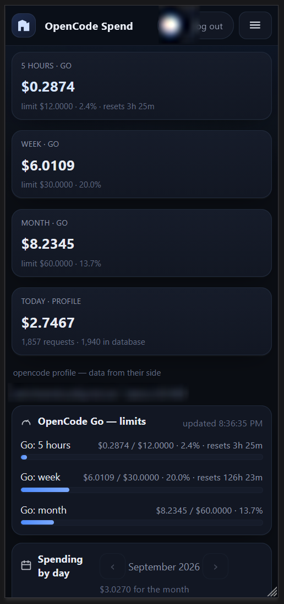
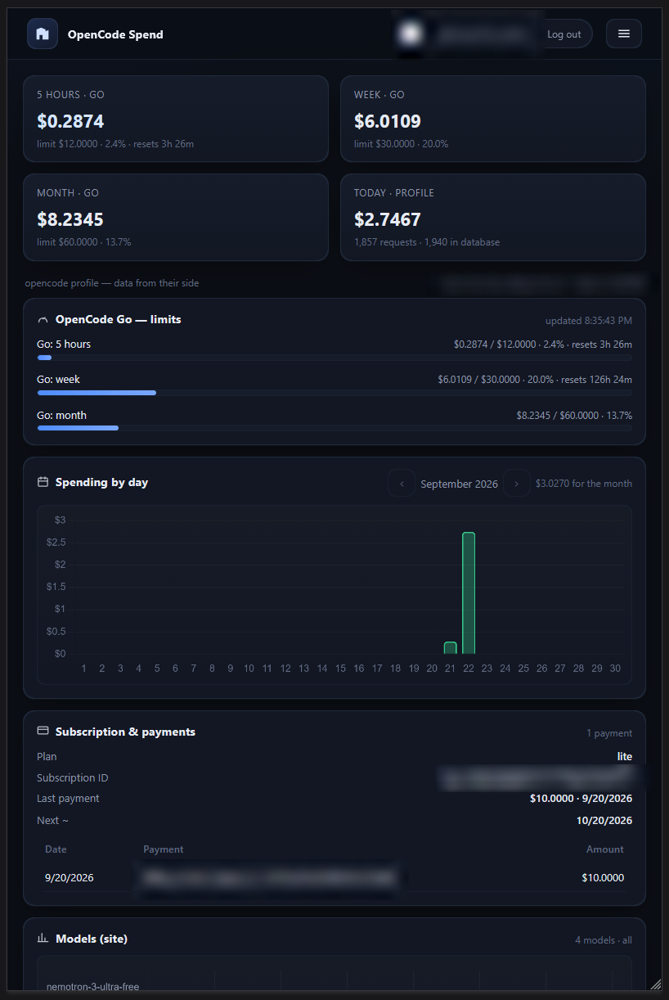

**English** | [Русский](README.ru.md)

# OpenCode Spend

[](https://github.com/JevKray/OpenCodeSpend)
[](https://dotnet.microsoft.com/)
[](https://learn.microsoft.com/dotnet/desktop/wpf/)
[](https://www.docker.com/)
[](https://www.sqlite.org/)
[](#)

[](https://agentstats.we4.online/)

Cost and activity monitoring for opencode. A desktop app collects the data and
sends it to a server, where a web panel manages accounts: spending, Go limits,
payments, live chats with phases, and a button to stop agents. Everything is
computed from opencode.ai (console) data and the local opencode database.

<p align="center">
  
</p>
<p align="center">
  
  
</p>

*Web panel: spending, Go limits, per-model breakdown, and active sessions.*

## 🌐 Hosted server — no need to deploy your own

The panel is already running: **https://agentstats.we4.online/**

You don't have to host your own server — just sign in and install the app:

1. Open **https://agentstats.we4.online/** and sign in (with Google or your account access code).
2. Download the app from [**Releases**](../../releases) — the `OpenCodeSpend-win-x64.zip` archive.
3. Unpack it and run `OpenCodeSpend.exe`.
4. On the site open **"Connection management"** and copy the pairing code.
5. In the app click **"Connect server"** and paste the code.
6. Done — spending, Go limits, and live sessions appear in the panel, viewable from any device.

> One account — one computer. Want your own server? See "🐳 Server deployment".

## ✨ Features

- **Go limits** — 5-hour / weekly / monthly windows with progress.
- **Daily spending** — cost dynamics over time.
- **Per-model breakdown** — where exactly the budget goes.
- **Request history** — a log of model calls.
- **Payments and subscription** — payment status and current plan.
- **Accurate active-chat tracking** — state comes from opencode itself, not from timers; sessions from all running opencode servers are collected into one tree.
- **Status indicator on the avatar** — online / offline / connected to the server.
- **Stop agents** — a "Stop" command is sent to the PC.
- **Multi-account** — several accounts on one server.
- **PC pairing by code** — one account = one PC.
- **Google/GitHub login + access code** — providers are optional.
- **RU/EN interface** — Russian and English, language detected automatically.
- **Responsive layout** — comfortable on phone and tablet.
- **Instant updates over SSE** — the browser updates without a reload.

## 🏗 Architecture

```
┌─────────────── PC (Windows) ───────────────┐        ┌──────── SERVER (Linux/Docker) ───────┐
│ opencode  ──SSE──▶ collector ──POST /api/device/sync──▶│ accounts, SQLite, web panel         │
│     ▲                   ◀── commands (stop) ──────────│ /api/events (SSE) ──▶ browser       │
└────────────────────────────────────────────┘        └──────────────────────────────────────┘
```

A single build plays two roles. The role is set by the `Spend:Mode` config
(`server` or `collector`) and by the presence of a local opencode database:

- **SERVER** (`Spend__Mode=server`) — accounts, login, data storage, web panel.
  It never talks to opencode itself.
- **COLLECTOR** (desktop app, WPF + WebView2) — serves the panel on a random
  local port, collects data, and sends it to the server.

Linking: the PC is paired to an account with a connection code (the server
address is encrypted inside it); from then on it sends one
`POST /api/device/sync` request per second and receives commands in the
response. If the server replies 401, the PC is unlinked.

## 🚀 Quick start

Server (locally, via Docker):

```bash
docker compose up -d --build
# panel: http://127.0.0.1:15000
```

Desktop app:

```bash
dotnet publish src/OpenCodeSpend.Desktop -c Release -r win-x64 --self-contained true -p:PublishSingleFile=true
```

First sign-in: on the server, log in with Google/GitHub or with your account
access code; then "Connection management" → copy the code → paste it in the app
under "Connect server".

## 🐳 Server deployment

You need a Linux server with Docker and the `docker compose` plugin.

**What to copy.** The project folder with `docker-compose.yml`, `Dockerfile`, and
the `src/OpenCodeSpend.Web` sources. The image builds in two stages:
`mcr.microsoft.com/dotnet/sdk:10.0` runs `restore` and
`publish -c Release -o /app`, then the `mcr.microsoft.com/dotnet/aspnet:10.0`
runtime copies `/app` and starts `dotnet OpenCodeSpend.Web.dll`.

**Configuration.** Create a `.env` based on `.env.example` and set the values.

**Run.**

```bash
docker compose up -d --build   # build and start
docker compose logs -f         # live logs
docker compose down            # stop (volumes are kept)
```

**Ports.** Inside the container the app listens on `5199`; externally the port is
published only on the host's loopback:

```yaml
ports:
  - "127.0.0.1:15000:5199"
```

There's no need to expose `5199` to the internet directly — outside access goes
through a reverse proxy to `127.0.0.1:15000`.

**Volumes.** Data survives rebuilds thanks to two volumes:

```yaml
volumes:
  - appdata:/data
  - dpkeys:/root/.aspnet/DataProtection-Keys
```

`appdata` stores the SQLite database `/data/opencodespend.db`. `dpkeys` stores
the ASP.NET Core Data Protection keys: lose them and session cookies are
invalidated and all users get logged out, while account data stays intact.

**Updating.** `docker compose up -d --build` rebuilds and restarts. For autostart,
enable the `restart: unless-stopped` policy on the Docker service (already set in
compose) — the container comes back up after a host reboot.

## 🔒 Domain and HTTPS

The panel does not terminate HTTPS itself — you need Caddy or nginx on the host
to listen on the domain, serve TLS, and proxy to `127.0.0.1:15000`. The app reads
the `X-Forwarded-Proto` and `X-Forwarded-Host` headers and builds links, including
OAuth redirects, from the request's scheme and host.

Caddy example:

```caddyfile
ocspend.example.com {
    reverse_proxy 127.0.0.1:15000
}
```

nginx example (add TLS separately, e.g. with certbot):

```nginx
server {
    listen 80;
    server_name ocspend.example.com;

    location / {
        proxy_pass http://127.0.0.1:15000;
        proxy_set_header Host              $host;
        proxy_set_header X-Forwarded-Proto $scheme;
        proxy_set_header X-Forwarded-Host  $host;
        proxy_set_header X-Forwarded-For   $proxy_add_x_forwarded_for;
    }
}
```

For the `/api/events` (SSE) stream in nginx you **must** disable buffering,
otherwise updates won't arrive instantly:

```nginx
location /api/events {
    proxy_pass http://127.0.0.1:15000;
    proxy_buffering off;
    proxy_set_header Host              $host;
    proxy_set_header X-Forwarded-Proto $scheme;
    proxy_set_header X-Forwarded-Host  $host;
}
```

**OAuth redirect URIs.** Set these in the provider consoles:

- Google Cloud Console → OAuth 2.0 Client ID → Authorized redirect URIs:
  `https://<domain>/signin-google`
- GitHub → OAuth App → Authorization callback URL: `https://<domain>/signin-github`

The app derives the address from the request itself, so it must match the one the
panel is opened at. If you don't need OAuth, logging in with an account access
code always works.

## ⚙️ Environment variables

`docker-compose.yml` reads these variables from `.env`. Secrets live only in
`.env` (they never make it into the image) and are passed to the container as
`Spend__*`.

| Variable | Value | Purpose |
| --- | --- | --- |
| `TZ` | `Europe/Moscow` | server time zone |
| `PAIRING_TTL` | `5` | PC pairing code lifetime, minutes |
| `GOOGLE_CLIENT_ID` | `` | Google OAuth client (optional) |
| `GOOGLE_CLIENT_SECRET` | `` | Google OAuth client secret |
| `GITHUB_CLIENT_ID` | `` | GitHub OAuth client (optional) |
| `GITHUB_CLIENT_SECRET` | `` | GitHub OAuth client secret |

## 🔌 Ports

| Port | Where | Purpose |
| --- | --- | --- |
| `5199` | inside the container | `ASPNETCORE_URLS` / `EXPOSE`, no need to change |
| `15000` | host mapping | `127.0.0.1:15000:5199`, entry point for the reverse proxy |
| `80` / `443` | reverse proxy | Caddy/nginx, public exposure |
| random | local on the PC | app panel, `127.0.0.1` only |

## 🧭 Example workflow

1. Deployed the server and opened the panel on your domain.
2. Signed in — with Google/GitHub or an account access code.
3. In the panel opened "Connection management" and copied the pairing code.
4. Pasted the code into the app under "Connect server".
5. Spending and Go limits appeared in the panel.
6. The "Sessions" section shows active chats with phases (typing, tool, command).
7. Clicked "Stop" — the agent stopped, and the state updated instantly.

## 🧱 Stack

- **.NET 10**
- **ASP.NET Core** — server logic, API, and web panel
- **WPF + WebView2** — desktop app
- **SQLite** — the only storage, a single file
- **Docker** — server build and deployment

## 📁 Structure

```
OpencodeSpend/
├─ src/
│  └─ OpenCodeSpend.Web/       # logic + wwwroot (index.html, app.js, styles.css)
│  └─ OpenCodeSpend.Desktop/   # WPF + WebView2, data collection and upload
├─ tests/
│  └─ OpenCodeSpend.Tests/     # self-checks
├─ docs/                       # screenshots
├─ docker-compose.yml
├─ Dockerfile
└─ .env.example
```

## 🧪 Tests

```bash
dotnet run --project tests/OpenCodeSpend.Tests
```

42 self-checks.

## ❓ Common issues

- **`redirect_uri_mismatch`** — the redirect URI isn't configured in the provider console.
- **The panel shows "no data"** — the PC isn't paired or got unlinked (server replied 401).
- **The profile doesn't load** — the opencode session in the app has expired; sign in again.
- **Sessions disappeared after a rebuild** — check that the `dpkeys` volume is in place.

---

## 📄 License

The project is distributed under the [MIT](LICENSE) license. The repository is open.

## 💬 Contacts & Support

<div align="center">

[](https://t.me/eugenekray)
[](mailto:krasovskyworks@gmail.com)
[](https://boosty.to/jevkray)

</div>
